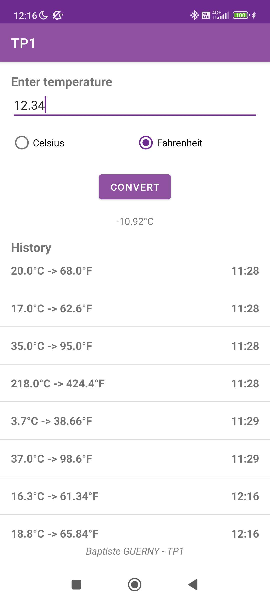

# TP1 - Convertisseur  de  température Celsius - Fahrenheit

## Objectifs

- Découvrir l'environnement de développement Android Studio
- Créer une application Android simple
- Installer et executer une application Android sur un émulateur ou un appareil physique à partir d'Android Studio

## Consignes (extraites du sujet)

Créer une application Android permettant de convertir une température en degrés Celsius en degrés Fahrenheit et vice-versa.

- Création de 2 fonctions de conversion
- Création d'une interface graphique simple contenant :
  - Un champ de saisie de texte
  - Un champ de texte qui affiche température convertie
  - Deux cases à cocher pour sélectionner l'unité ciblé (Celsius ou Fahrenheit)
  - Un bouton de validation
- Gestion des événements de clic sur le bouton de validation

## Réalisation

### Fonctionalités demandées

- Création d'un projet Android Studio
- Création d'une fonction de conversion à partir des formules données
- Création de l'interface graphique
- Ajout des événements de clic sur le bouton de validation

### Fonctionalités supplémentaires

- Le champ d'entrée est vidé lors de la validation
- Le champ de sortie affiche un message d'erreur si la température n'est pas saisie lors de la validation
- Ajout d'un footer avec en hyperlien le nom de l'auteur et le numéro du TP menant vers le dépôt GitHub du TP
- Ajout d'un historique de conversion
  - Création d'une classe `HistoryElement` pour stocker la date de conversion, la température saisie et la température convertie, ainsi que l'unité de conversion affin d'afficher de manière formattée chaque élément de l'historique
  - Affichage des éléments de l'historique dans une `ListView`
  - L'historique est sauvegardé et rechargé lors de la réouverture de l'application
  - L'historique est limité à 10 éléments pour eviter de stocker trop de données
- Ajout d'une icone d'application dans le style du logo de l'IUT

## Captures d'écran

