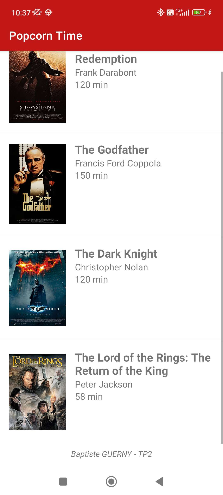

# TP1 - Convertisseur  de  température Celsius - Fahrenheit

## Objectifs

- Se familiariser avec la définition des interfaces Android
- Découvrir la gesition et l'affichage de listes
- Découvrir la fonctionalité de Toast

## Consignes (extraites du sujet)

Créer une application Android permettant d'afficher les films à l'affiche dans un cinéma.

- Création d'une classe `Film` pour stocker les informations d'un film
- Création d'une vue `film_list_item.xml` qui affiche les informations d'un film
- Création d'une `ListView` pour afficher la liste des films
- Utilisation d'un Adapter pour afficher les films dans la `ListView` et gérer les clics sur les éléments
- Affichage du titre du film dans un `Toast` lors du clic sur un élément de la liste

## Réalisation

- L'application affiche une liste de films, pour le mpment, la liste est statique et définie en dur dans le code.
- Le titre du film s'affiche dans un `Toast` lors du clic sur un élément de la liste.

## Captures d'écran

