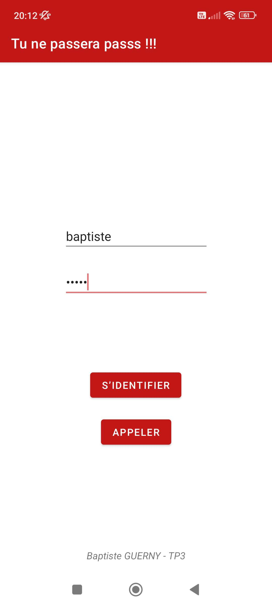
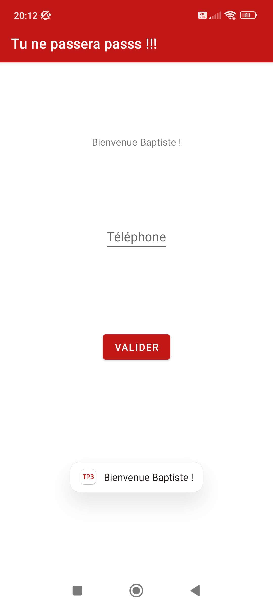

# TP3 - Compositeur de numéros de téléphone protégés par mot de passe

## Objectifs
- se familiariser avec la communication entre composants
- découvrir les intents

## Consignes (extraites du sujet)
Application au fonctionnement irréel, mais visant principalement à manipuler les intents.
- Avoir une activité principale et une activité secondaire
- Sur l'activité principale, des champs identifiants/mot de passe, un bouton "S'identifier" et un bouton "Appeler".
- L'action sur le bouton "S'identifier" envoie les données d'identifiants et mot de passe dans la seconde activité, avec une attente de retours
- Dans la seconde activité, ça verrifie que les identifiants sont correctes, un champ de texte permet d'entrer un numéro de téléphone, et un bouton Valider
- Ce bouton Valider termine l'activité secondaire et renvoie à l'activité principale le numéro de téléphone entré
- Un appui sur le bouton "Appeler" lance un intent avec le numéro de téléphone en paramètre, ouvrant le dialer du téléphone.

## Captures d'écran

